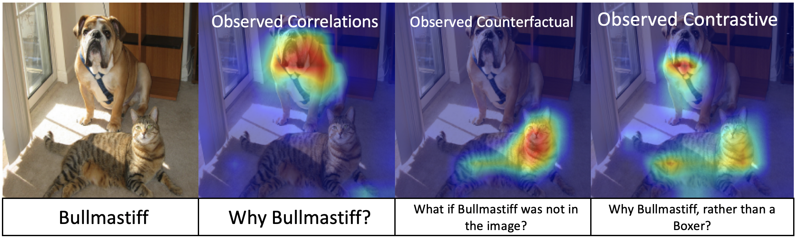

# Explanatory-Paradigms-in-Neural-Networks
Code used in the paper [Explanatory Paradigms in Neural Networks](https://arxiv.org/abs/2202.11838), accepted at the Signal Processing Magazine, Special Issue on Data Science and Explainability. 

AlRegib, G., & Prabhushankar, M. (2022). Explanatory Paradigms in Neural Networks. arXiv preprint arXiv:2202.11838.

**Abstract** 

In this article, we present a leap-forward expansion to the study of explainability in neural networks by considering explanations as answers to abstract reasoning-based questions. With *P* as the prediction from a neural network, these questions are **Why P?**, **What if not P?**, and **Why P, rather than Q?** for a given contrast prediction *Q*. The answers to these questions are observed correlations, observed counterfactuals, and observed contrastive explanations respectively. Together, these explanations constitute the abductive reasoning scheme. We term the three explanatory schemes as observed explanatory paradigms. The term observed refers to the specific case of *post-hoc* explainability, when an explanatory technique explains the decision *P* after a trained neural network has made the decision *P*. The primary advantage of viewing explanations through the lens of abductive reasoning-based questions is that explanations can be used as reasons while making decisions. The post-hoc field of explainability, that previously only justified decisions, becomes active by being involved in the decision making process and providing limited, but relevant and contextual interventions. The contributions of this article are: (i) realizing explanations as reasoning paradigms, (ii) providing a probabilistic definition of observed explanations and their completeness, (iii) creating a taxonomy for evaluation of explanations, and (iv) positioning gradient-based complete explanainability's replicability and reproducibility across multiple applications and data modalities.

 

**Paper** : [Explanatory Paradigms in Neural Networks](https://arxiv.org/abs/2202.11838)

## Usage 

**Version 1** (March 1 2022): The function methods.py consists of classes for [GradCAM](https://arxiv.org/abs/1610.02391) (observed correlations), [CounterfactualCAM](https://arxiv.org/abs/1610.02391) (observed counterfactuals), and [ContrastCAM](https://arxiv.org/abs/2008.00178) (observed contrast). All these methods are called from the main.py function for any of ResNet, VGG16, Densenet, AlexNet, and SqueezeNet architectures.

1. Select the pretrained model in line 58 of main.py
2. Choose the appropriate model_dict from lines 60-68. For your own model, please define the target layer within utils.py. Tip: Last convolution layer is generally better since it has the maximum amount of semantic information
3. By default, the GradCAM and CounterfactualCAM results are displayed for the predicted. If you want to see results for another class, please pass the class number as an arguement within gradcam and counterfactualCAM classes in Lines 74 and 87.
4. By default the ContrastCAM shows results for a class *Q* that has the second highest probability of prediction. If you want to see results for another class, please pass the class number as an arguement within contrastCAM class in Line 81.


## Citation 

Please cite the following two papers if this code is used: 

1. [Contrastive Explanations in Neural Networks](https://arxiv.org/abs/2008.00178) : Prabhushankar, M., Kwon, G., Temel, D., & AlRegib, G. (2020, October). Contrastive explanations in neural networks. In 2020 IEEE International Conference on Image Processing (ICIP) (pp. 3289-3293). IEEE.

```
@inproceedings{prabhushankar2020contrastive,
  title={Contrastive explanations in neural networks},
  author={Prabhushankar, Mohit and Kwon, Gukyeong and Temel, Dogancan and AlRegib, Ghassan},
  booktitle={2020 IEEE International Conference on Image Processing (ICIP)},
  pages={3289--3293},
  year={2020},
  organization={IEEE}
}
```

2. [Explanatory Paradigms in Neural Networks](https://arxiv.org/abs/2202.11838) : AlRegib, G., & Prabhushankar, M. (2022). Explanatory Paradigms in Neural Networks. arXiv preprint arXiv:2202.11838.

```
@article{alregib2022explanatory,
  title={Explanatory Paradigms in Neural Networks},
  author={AlRegib, Ghassan and Prabhushankar, Mohit},
  journal={arXiv preprint arXiv:2202.11838},
  year={2022}
}
```

**Code Acknowledgements** :  The code is built on Grad-CAM. We use the implementation of **https://github.com/1Konny/gradcam_plus_plus-pytorch** as our base code. 
