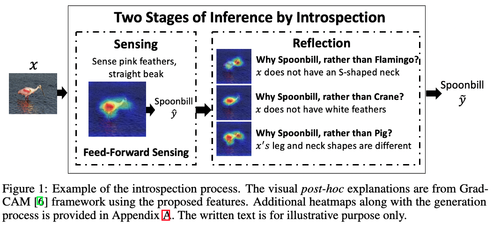

# Introspective-Learning
Code used in the paper [Introspective Learning : A Two-Stage Approach for Inference in Neural Networks](https://arxiv.org/pdf/2209.08425.pdf), accepted at Advances in Neural Information Processing Systems (2022), Nov 29 - Dec 1, 2022. 

M. Prabhushankar and G. AlRegib, "Introspective Learning : A Two-Stage Approach for Inference in Neural Networks" Advances in Neural Information Processing Systems (2022), Nov 29 - Dec 1, 2022.

**Abstract** 

In this paper, we advocate for two stages in a neural network's decision making process. The first is the existing feed-forward inference framework where patterns in given data are sensed and associated with previously learned patterns. The second stage is a slower reflection stage where we ask the network to reflect on its feed-forward decision by considering and evaluating all available choices. Together, we term the two stages as introspective learning. We use gradients of trained neural networks as a measurement of this reflection. A simple three-layered Multi Layer Perceptron is used as the second stage that predicts based on all extracted gradient features. We perceptually visualize the post-hoc explanations from both stages to provide a visual grounding to introspection. For the application of recognition, we show that an introspective network is 4% more robust and 42% less prone to calibration errors when generalizing to noisy data. We also illustrate the value of introspective networks in downstream tasks that require generalizability and calibration including active learning, out-of-distribution detection, and uncertainty estimation. Finally, we ground the proposed machine introspection to human introspection for the application of image quality assessment.

 

**Paper** : [Introspective Learning : A Two-Stage Approach for Inference in Neural Networks](https://arxiv.org/pdf/2209.08425.pdf)

## Usage 

**Version 1** (September 26 2022): The function methods.py consists of classes for [GradCAM](https://arxiv.org/abs/1610.02391) (sensing explanations), [CounterfactualCAM](https://arxiv.org/abs/1610.02391) (observed counterfactuals), and [ContrastCAM](https://arxiv.org/abs/2008.00178) (observed contrast). All these methods are called from the main.py function for any of ResNet, VGG16, Densenet, AlexNet, and SqueezeNet architectures.

1. Select the pretrained model in line 58 of main.py
2. Choose the appropriate model_dict from lines 60-68. For your own model, please define the target layer within utils.py. Tip: Last convolution layer is generally better since it has the maximum amount of semantic information
3. By default, the GradCAM and CounterfactualCAM results are displayed for the predicted. If you want to see results for another class, please pass the class number as an arguement within gradcam and counterfactualCAM classes in Lines 74 and 87.
4. By default the ContrastCAM shows results for a class *Q* that has the second highest probability of prediction. If you want to see results for another class, please pass the class number as an arguement within contrastCAM class in Line 81.


## Citation 

Please cite following two paper if this code is used: 

1. [Introspective Learning : A Two-Stage Approach for Inference in Neural Networks](https://arxiv.org/pdf/2209.08425.pdf) : M. Prabhushankar and G. AlRegib, "Introspective Learning : A Two-Stage Approach for Inference in Neural Networks" Advances in Neural Information Processing Systems (2022), Nov 29 - Dec 1, 2022.

```
@article{prabhushankar2022introspective,
  title={Introspective learning: A two-stage approach for inference in neural networks},
  author={Prabhushankar, Mohit and AlRegib, Ghassan},
  journal={arXiv preprint arXiv:2209.08425},
  year={2022}
}
```

**Code Acknowledgements** :  The introspective explanation code is built on Grad-CAM. We use the implementation of **https://github.com/1Konny/gradcam_plus_plus-pytorch** as our base code. 

